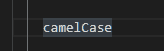
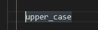
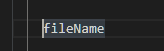

# Change Upper Lower Case at Caret

* Change upper/lower case.  
大文字,小文字の切り替えを行います。
* Unlike standard functions, easy to change a character-by-character basis.
標準機能と異なり、文字単位での切り替えが容易です。
  * When not selected, change only one character.  
  非選択時は、1文字のみの切り替えを行います。
  * Change all selection.  
  選択文字列の全ての、大文字,小文字を揃えます。

# Use Case

* to CamelCase

* to UPPER_CASE

* append word

# Link

* [GitHub](https://github.com/kuone314/ChangeUpperLowerCase)
* [Twitter](https://twitter.com/KuoneTech)
